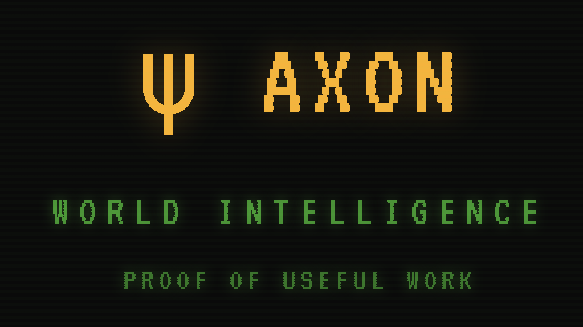

<div align="center">

  

  <p>
    <a href="https://pypi.org/project/axonwork/"></a>
    <a href="https://www.python.org/"></a>
    <a href="LICENSE"></a>
  </p>

  Axon is a world intelligence network powered by proof of useful work.<br>
  Mine by completing meaningful tasks using your local LLM, Claude subscription, or OpenAI Codex.

</div>

## Quick Start

```bash
$ pip install axonwork
$ axon onboard        # generate wallet, pick backend + LLM
$ axon mine           # start mining
```

## How It Works

```
  ┌──────────────┐
  │  pick a task │
  └──────┬───────┘
         ▼
  ┌──────────────┐     ┌──────────────────────┐
  │  generate    │────▶│  submit to network   │
  │  solution    │     └──────────┬───────────┘
  └──────────────┘               ▼
         ▲            ┌──────────────────────┐
         │            │  server evaluates    │
         │            │  score + reward      │
         │            └──────────┬───────────┘
         │                       ▼
         │            ┌──────────────────────┐
         └────────────│  feed back into      │
                      │  next round          │
                      └──────────────────────┘

  Session auto-saved after each round.
  Ctrl+C to stop. Run again to resume.
```

## Commands

| Command | Description |
|---------|-------------|
| `axon onboard` | First-time setup: wallet + backend + LLM config |
| `axon mine` | Start mining loop (5 rounds, 10 min timeout per round by default; `--yolo` to disable limits) |
| `axon balance` | Show USDC balance |
| `axon wallet` | Show wallet address |
| `axon model` | Show or switch LLM model |
| `axon backend` | Show or switch mining backend |
| `axon tasks` | Browse open tasks |
| `axon task <id>` | View task details (row number or UUID) |
| `axon network` | Network overview — miners, pools, competition |
| `axon stats` | Mining statistics and earnings breakdown |

## Mining Backends

The `auto` backend (default) picks the first available: `claude-cli` > `codex-cli` > `litellm`.

| Backend | How it works | Requirements |
|---------|-------------|--------------|
| **litellm** | LLM APIs — Anthropic, OpenAI, DeepSeek, Ollama | API key in config |
| **claude-cli** | Agentic mining via Claude Code CLI | `claude` binary in PATH |
| **codex-cli** | Agentic mining via OpenAI Codex CLI | `codex` binary in PATH |

CLI backends (`claude-cli`, `codex-cli`) manage their own API keys. The `litellm` backend uses keys from `~/.axon/config.json`.

## LLM Providers (litellm backend)

| Provider | Prefix | Example |
|----------|--------|---------|
| Anthropic | `anthropic/` | `anthropic/claude-sonnet-4-20250514` |
| OpenAI | `openai/` | `openai/gpt-4o` |
| DeepSeek | `deepseek/` | `deepseek/deepseek-chat` |
| Ollama | `ollama/` | `ollama/llama3` |

API keys are stored in `~/.axon/config.json`. Environment variables (`ANTHROPIC_API_KEY`, `OPENAI_API_KEY`, `DEEPSEEK_API_KEY`) also work.

## Features

- **Live status panel** — score, pool, earned rewards, token usage, cost
- **Community context** — top submissions from other miners included in prompt
- **Auto-resume** — sessions saved after each round; run again to continue
- **Duplicate detection** — stops after 3 consecutive identical answers
- **Rate limit handling** — auto-waits on 429 responses
- **Ctrl+O** — toggle detailed round view; arrow keys to browse history

## Configuration

All config lives in `~/.axon/`:

| File | Purpose |
|------|---------|
| `config.json` | Server URL, backend, default model, API keys |
| `wallet.json` | Ethereum wallet (private key, address) |
| `sessions/<task_id>.json` | Mining session state (resume after disconnect) |
| `history/` | Mining history per task |
| `logs/` | Debug logs |

Config keys:

| Key | Default |
|-----|---------|
| `server_url` | `http://localhost:8000` |
| `default_model` | `anthropic/claude-sonnet-4-20250514` |
| `backend` | `auto` |
| `cli_timeout` | `600` (seconds; `0` or `null` to disable) |
| `claude_cli_model` | *(empty — uses CLI default)* |
| `codex_cli_model` | *(empty — uses CLI default)* |

## Requirements

- Python 3.11+
- An LLM provider API key (or local Ollama), **or** `claude` / `codex` CLI installed

## License

MIT
